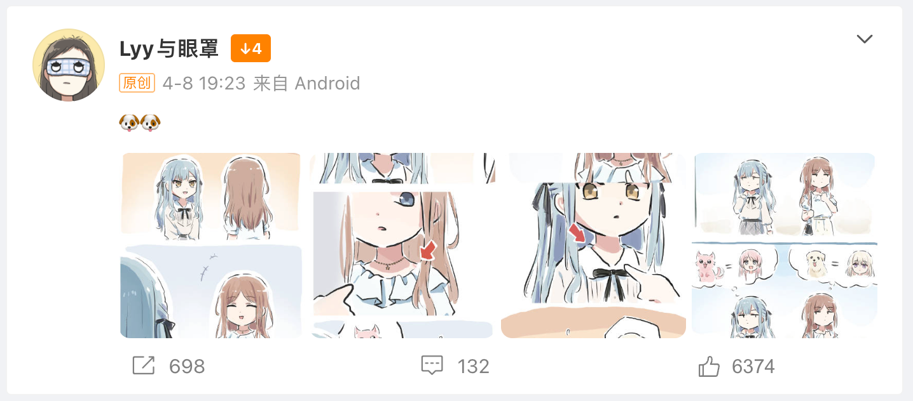
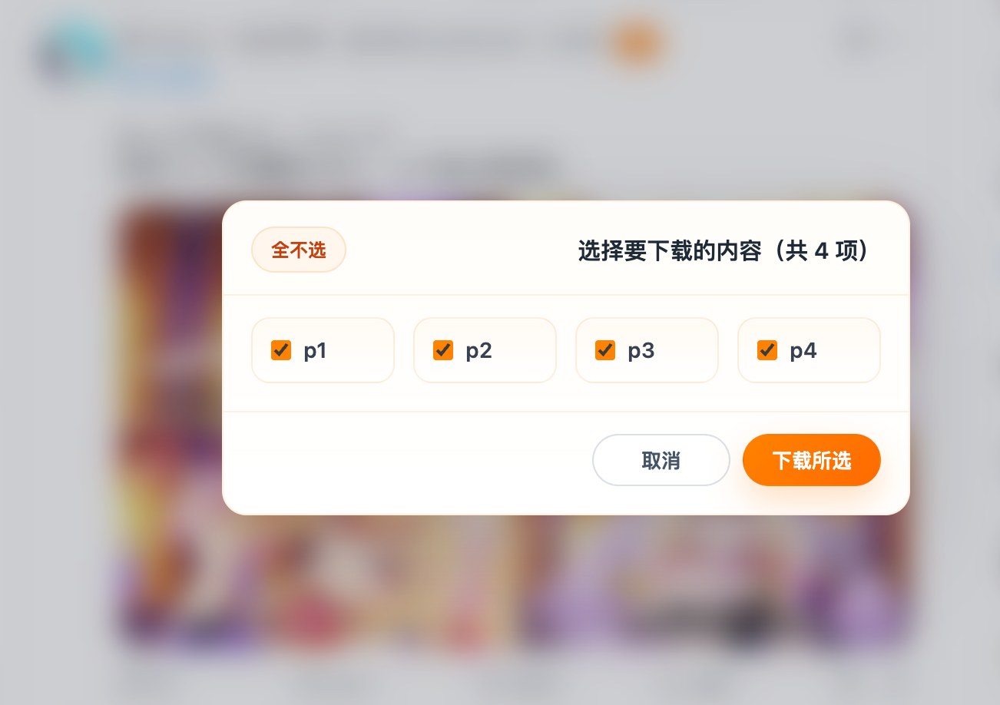

# 微博/X图片批量下载器

> 一键下载微博和X（原Twitter）帖子中的所有图片为原图，可选开启视频下载。

## 功能特性

- 一键下载当前帖子中的所有图片为原图
- 自动将缩略图/中图转换为高质量原图
- 微博 live photo 自动识别，下载时同时保存封面图和原始 `.mov`
- 微博 `gif` 仅下载 `.gif` 文件，不额外下载视频封装
- 默认微博混合媒体帖子会自动跳过纯视频项，保留其中可下载的图片项
- 可在油猴菜单中开启视频下载；开启后会同时下载当前帖子中的图片、GIF、Live Photo 和视频
- 微博视频默认选择接口可用清晰度中的最高质量；X 普通视频在页面 DOM 暴露直链时支持下载
- X 动图（GIF）会下载为可播放的 `.mp4` 动图源
- 默认 X 纯视频帖子不显示下载按钮；同条内容里若仍有图片/GIF，则保留图片/GIF 下载按钮
- 批量下载支持，避免浏览器并发限制
- 下载失败时自动切换二进制兜底，不再退化为批量打开图片新标签页
- 支持动态加载内容（无限滚动）
- 文件命名包含帖子ID，方便整理

## 安装方法

### 方法1：Tampermonkey（推荐）

1. 安装 [Tampermonkey](https://www.tampermonkey.net/) 浏览器扩展
2. 点击 [dist/weibo-image-downloader.user.js](https://github.com/gbandszxc/weibo-image-downloader/raw/refs/heads/main/dist/weibo-image-downloader.user.js) 文件
3. 或者在 Tampermonkey 面板中选择"添加新脚本"
4. 将 `dist/weibo-image-downloader.user.js` 的内容粘贴进去并保存

### 方法2：Violentmonkey

1. 安装 [Violentmonkey](https://violentmonkey.github.io/) 浏览器扩展
2. 同样的方式添加脚本

## 使用方法



*下载按钮会显示为橙色 `↓N`，其中 `N` 表示当前帖子中可下载的媒体数量；默认只统计图片、GIF 和 Live Photo。*



*长按下载按钮后会展开选择弹窗，可按媒体项勾选下载；普通图片显示为 `p1`、`p2`，Live Photo 显示为 `lp1`、`lp2`，动图显示为 `a1`、`a2`。开启视频下载后，视频显示为蓝色系 `v1`、`v2`。*

### 设置

在 Tampermonkey/Violentmonkey 的脚本菜单中点击 **“视频下载：[关闭/开启]”** 可切换视频下载。默认关闭，关闭时脚本行为与图片下载版本一致；切换后当前页面会立即刷新下载按钮状态。

### 微博

1. 打开微博首页 https://weibo.com、移动端 https://m.weibo.cn/ 或任意微博页面
2. 浏览微博，找到包含图片的帖子
3. 在每条微博的下方（点赞/评论/转发按钮旁边）会出现一个橙色的 **"↓N"** 按钮
4. 点击按钮即可批量下载该条微博的所有图片
5. 长按按钮可按媒体项手动选择；微博 live photo 选中后会同时下载 `.jpg` 和 `.mov`
6. 默认纯视频微博不会显示图片下载按钮；`gif` 会按单个 `.gif` 媒体项处理
7. 开启视频下载后，纯视频微博也会显示下载按钮，点击会下载最高可用清晰度的视频

### X（原Twitter）

1. 打开X首页 https://x.com 或任意X页面
2. 浏览推文，找到包含图片的帖子
3. 在每条推文的发送时间右侧会出现一个橙色的 **"↓N"** 按钮
4. 点击按钮即可批量下载该条推文的所有图片
5. X 动图（GIF）会下载为 `.mp4` 动图源；默认纯视频帖子不会显示图片下载按钮
6. 开启视频下载后，页面中能直接解析到视频直链的普通视频会纳入下载

## 支持的页面

### 微博
- 微博首页 feed 流
- 用户主页
- 微博搜索结果页（weibo.com 及 s.weibo.com）
- 微博详情页
- 微博移动端首页 `m.weibo.cn/`
- 微博移动端用户主页 `m.weibo.cn/profile/...`
- 微博移动端搜索页 `m.weibo.cn/search`

### X（原Twitter）
- X首页 feed 流
- 用户主页
- 搜索结果页
- 推文详情页

## 常见问题

### Q: 点击按钮没有反应？

A: 请确保已正确安装 Tampermonkey 扩展，并且脚本已启用。可以在浏览器右上角的 Tampermonkey 图标查看。

### Q: 下载的图片不清晰？

A: 本脚本会自动将图片URL中的尺寸标识替换为原图：
- 微博：将 mw690、bmiddle、orj360 等替换为 large
- X：将 name=small、name=large 替换为 name=orig

### Q: 下载失败怎么办？

A: 
- 检查网络连接
- 尝试刷新页面后重新下载
- 如果是部分图片失败，可能是微博图片加载问题

### Q: 文件名是怎么生成的？

A: 
- 微博：`weibo_{帖子ID}_{序号}.jpg`
- 微博 GIF：`weibo_{帖子ID}_{序号}.gif`
- 微博 live photo 视频：`weibo_{帖子ID}_{序号}_live.mov`
- 微博视频：`weibo_{帖子ID}_{序号}.mp4`
- X 图片：`x_{帖子ID}_{序号}.jpg`
- X GIF：`x_{帖子ID}_{序号}.mp4`
- X 视频：`x_{帖子ID}_{序号}.mp4`

## 技术细节

### 图片URL转换

**微博图片URL**通常包含尺寸标识：
- `thumb180` / `orj360` - 缩略图
- `bmiddle` - 中图
- `mw690` - 大图
- `large` - 原图

**X平台图片URL**使用查询参数：
- `name=small` - 缩略图
- `name=large` - 大图
- `name=orig` - 原图

脚本会自动将任意尺寸的URL转换为原图URL。

### 下载策略

- 每批下载 5 张图片
- 批次间延迟 300ms
- 避免触发平台的反爬机制
- 兼容 Chrome 浏览器的下载限制

## 开发

```bash
bun install
bun run build
bun run test
bun run test:placement
bun run verify:dist
```

- 源码位于 `src/`
- 平台实现位于 `src/platforms/`，共享流程通过统一适配器调用
- `bun run test:placement` 可单独校验微博/X 各页面按钮位置是否回归
- 发布产物位于 `dist/weibo-image-downloader.user.js`
- 版本号以 `package.json` 为准，发布时需同步更新 Git tag、README 更新日志和最终 userscript `@version`
- 发布前执行 `bun run verify:dist`，确认 `dist/` 产物已由当前源码重新生成且 metadata 一致

## 更新日志

### v1.4.3
- 新增：实验性支持微博 / X 平台视频下载（需手动开启设置，并授予相应权限）

### v1.4.2
- 新增：移动端微博适配
- 修复：微博详情页点击下载按钮，弹出图片数量新标签不执行下载行为
- 修复：Tampermonkey `@connect` 改为根域名声明，兼容微博图片子域名下载
- 修复：补充 `@connect *` 兜底，兼容微博图片下载中的重定向与未预料域名校验

### v1.4.1
- 修复：X 动图（GIF）改为下载可播放的 `.mp4` 动图源，不再误下成 `.jpg` 缩略图
- 修复：X 纯视频帖子不再注入下载按钮；含图片/GIF 的帖子仍保留下载按钮
- 修复：X 时间线、用户页、详情页统一使用时间锚点注入下载按钮，减少详情页按钮丢失问题

### v1.4.0
- 重构：引入 `esbuild` 构建链，改为 `src/` 模块化开发、`dist/` 单文件发布
- 优化：移除 `@require` 与 `@resource` 外部依赖，兼容 GreasyFork 单文件同步
- 优化：统一样式来源，减少脚本与样式重复维护

### v1.3.3
- 新增功能：微博 live photo 下载时自动同时保存封面图和原始 `.mov`
- 修复：微博详情页部分 live photo 识别数量不正确，改为优先使用微博详情接口中的 `pic_ids/pic_infos` 解析媒体列表
- 修复：微博首页、用户页、详情页中的转发微博媒体数量与原微博不一致时，统一改为以微博接口结果为准
- 修复：微博 `gif` 不再额外下载一份视频文件
- 修复：微博“视频 + 图片”混合帖子会正确保留图片下载按钮
- 修复：微博纯视频或多视频帖子不再把视频封面误识别为可下载图片

### v1.3.2
- 修复：搜索页（s.weibo.com）下载按钮位置错误，现在正确显示在作者名同行末尾
- 修复：搜索页部分帖子（使用 m1/m4 等图片容器）无法显示下载按钮
- 修复：微博首页下载按钮宽度被页面 JS 强制压缩，数字溢出按钮的问题

### v1.3.1
- 新增功能：支持微博搜索页（s.weibo.com）注入下载按钮和"跳转原文"菜单项

### v1.3.0
- 重构：脚本模块化拆分，提升可维护性
- 拆分 config.js、utils.js、ui.js、style.css 四个独立文件
- 使用 jsDelivr CDN 加速资源加载

### v1.2.2
- 优化：下载提示改为非阻塞式 Toast 通知，不阻断当前操作，可手动关闭或自动消失
- 优化：下载按钮宽度自适应文字内容，避免多张图片时数字溢出

### v1.2.1
- 新增功能：微博"更多"菜单中新增"跳转原文"选项，点击后在新标签页打开该条微博详情页

### v1.2.0
- 新增功能：长按按钮触发弹窗，支持手动选择下载图片

### v1.1.9
- 修复按钮展示、图片获取、下载相关问题
- 优化微博端按钮部分场景展示位置
- 修复微博下载异常问题

### v1.1.0
- 新增X（原Twitter）平台支持

### v1.0.0
- 初始版本
- 支持批量下载微博原图
- 支持动态内容监听
